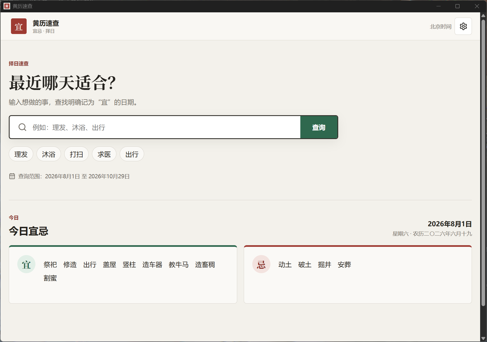
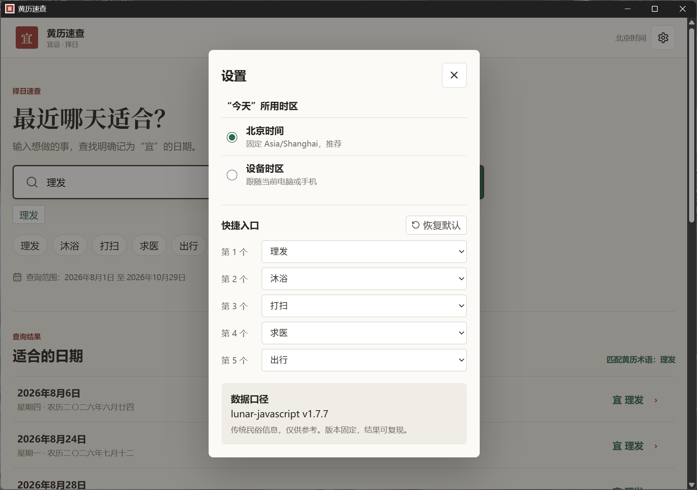
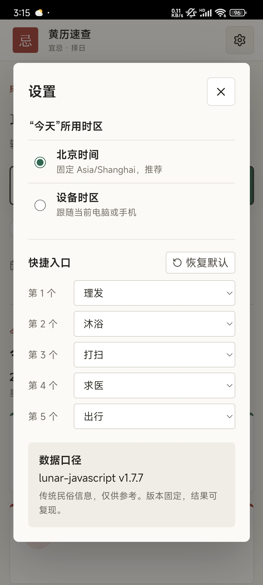

# 黄历速查 (Huangli Almanac)

> 快速查询每日宜忌和未来适宜日期 — Chinese almanac for daily auspicious guidance and future date planning.

## ✨ 优势

- ⚡ **启动极快** — 基于 Tauri 2 桌面端，原生性能，秒开无等待；Web 端 PWA 离线可用
- 🔒 **无需任何权限** — 桌面端仅请求 `core:default` 基础权限，不上传任何数据，完全离线运行
- 📦 **体积小巧** — Windows 安装包仅 ~1.9 MB，Android APK 仅 ~3.2 MB，不占空间
- 🌐 **全平台覆盖** — Web / Windows / Android 三端统一体验
- 🚫 **无广告、无追踪** — 纯净工具，专注黄历查询

## 📸 界面展示

### 桌面端

**查询宜**



**查询忌**


**设置与时区**



### 移动端

**查询宜**


**查询忌**


**设置与时区**



- 🔄 点击左上角 **「宜/忌」** 图标切换查询模式
- 🔍 在搜索框输入事项（如"理发""出行"），查找宜忌日期
- ⚙️ 点击右上角齿轮可设置时区、自定义快捷入口

## 功能

- 📅 查询每日黄历宜忌
- 🔍 查找未来适宜做某事的日期
- 🌙 农历日期显示
- ⏰ 多时区支持，海外用户也可使用
- 🔧 自定义快捷助手，常用宜忌一键查询
- 📱 支持 Web / Windows / Android

## 技术栈

Preact + TypeScript + Vite + Tauri 2 + Capacitor + PWA

## 项目结构

```
huangli-almanac/
├── src/                     # 前端源码
│   ├── main.tsx             # 应用入口
│   ├── app.tsx              # 根组件
│   ├── components/          # UI 组件
│   ├── pages/               # 页面组件
│   ├── domain/              # 业务逻辑（黄历、搜索、时区）
│   ├── state/               # 状态管理（用户偏好）
│   ├── types/               # TypeScript 类型声明
│   └── styles.css           # 全局样式
├── src-tauri/               # Tauri 桌面端（Rust）
│   ├── src/                 # Rust 源码
│   ├── icons/               # 应用图标（全平台）
│   ├── Cargo.toml           # Rust 依赖
│   └── tauri.conf.json      # Tauri 配置
├── android/                 # Android 项目（Capacitor）
├── scripts/                 # 构建/打包脚本
├── tests/                   # 测试文件（Vitest + Playwright）
├── public/                  # 静态资源（PWA 图标等）
├── docs/                    # 设计文档与规划
├── release/                 # 构建产物（.apk / .exe）
├── screenshots/             # 界面截图
│
├── index.html               # HTML 入口
├── package.json             # npm 项目配置与脚本
├── package-lock.json        # 依赖锁定文件
├── capacitor.config.json    # Capacitor 移动端配置
│
├── tsconfig.json            # TypeScript 根配置（引用子配置）
├── tsconfig.app.json        # 前端源码 TS 配置
├── tsconfig.node.json       # 构建工具 TS 配置（Vite 等）
│
├── vite.config.ts           # Vite 构建配置
├── vitest.config.ts         # 测试框架配置
│
├── LICENSE                  # MIT 协议
└── README.md
```

## 数据来源

本项目农历及黄历数据基于 **[lunar-javascript](https://github.com/6tail/lunar-javascript)**（作者：6tail），遵循其 MIT 协议。

## 开发

```bash
npm install
npm run dev          # Web 开发模式
npm run desktop:dev  # Tauri 桌面端
npm run android:sync # Android 同步
```

## 构建

```bash
npm run build        # Web 构建
npm run package:all  # 打包所有平台
```

## 协议

MIT License — 详见 [LICENSE](./LICENSE)
